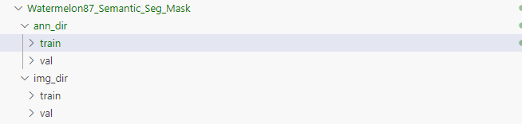

# 西瓜语义分割训练
- [西瓜语义分割训练](#西瓜语义分割训练)
  - [西瓜数据集的获取](#西瓜数据集的获取)
  - [数据集的显示](#数据集的显示)
  - [configs配置文件](#configs配置文件)
  - [训练](#训练)

## 西瓜数据集的获取
1. 下载地址：[https://zihao-openmmlab.obs.cn-east-3.myhuaweicloud.com/20230130-mmseg/dataset/watermelon/Watermelon87_Semantic_Seg_Mask.zip](https://zihao-openmmlab.obs.cn-east-3.myhuaweicloud.com/20230130-mmseg/dataset/watermelon/Watermelon87_Semantic_Seg_Mask.zip)
2. 数据集的结构:  


## 数据集的显示
几个重要的函数：
- cv2.imread
- cv2.addWeighted
- np.unique
- plt
    - plt.figure
    - plt.imshow
    - plt.axis
    - plt.show
    - plt.subplots

## configs配置文件
新增自定义数据集([官方文档](https://mmsegmentation.readthedocs.io/zh_CN/latest/advanced_guides/add_datasets.html))
1. 创建mmseg/datasets/example.py
2. 在mmseg/datasets/__init__中导入模块并注册
3. 新建一个数据集配置文件configs/_base_/datasets/example_datasets.py：其中包含了**数据集路径**、**预处理**、**后处理**、**DataLoader**、**测试集评估指标**

## 训练
1. 确定要使用的模型，例如PSPNet
2. 把自己的数据配置加载进去
3. 使用cfg.xxxx = xxxx的方式修改配置文件
```python
cfg.model.data_preprocessor.size = cfg.crop_size

# 单卡训练时，需要把 SyncBN 改成 BN
cfg.norm_cfg = dict(type='BN', requires_grad=True)
cfg.model.backbone.norm_cfg = cfg.norm_cfg
cfg.model.decode_head.norm_cfg = cfg.norm_cfg
cfg.model.auxiliary_head.norm_cfg = cfg.norm_cfg

# 模型 decode/auxiliary 输出头，指定为类别个数
cfg.model.decode_head.num_classes = NUM_CLASS
cfg.model.auxiliary_head.num_classes = NUM_CLASS

# 训练 Batch Size
cfg.train_dataloader.batch_size = 4

# 结果保存目录
cfg.work_dir = './work_dirs/ZihaoDataset-PSPNet'

# 模型保存与日志记录
cfg.train_cfg.max_iters = 40000 # 训练迭代次数
cfg.train_cfg.val_interval = 500 # 评估模型间隔
cfg.default_hooks.logger.interval = 100 # 日志记录间隔
cfg.default_hooks.checkpoint.interval = 2500 # 模型权重保存间隔
cfg.default_hooks.checkpoint.max_keep_ckpts = 1 # 最多保留几个模型权重
cfg.default_hooks.checkpoint.save_best = 'mIoU' # 保留指标最高的模型权重

# 随机数种子
cfg['randomness'] = dict(seed=0)
```
4. 导出config配置文件（带有模型

**开始训练**
```sh
python tools/train.py xxxxx
# xxxxx是你上一步保存到config文件地址
```