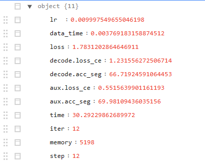

# 训练过程中测试指标
- [训练过程中测试指标](#训练过程中测试指标)
  - [设置matplotlib中文字体](#设置matplotlib中文字体)
  - [训练日志存放在之前的模型配置文件指示的位置](#训练日志存放在之前的模型配置文件指示的位置)
    - [那么训练日志的内容和格式是什么呢](#那么训练日志的内容和格式是什么呢)
  - [我们要把每一行读入，安装测试和训练分开](#我们要把每一行读入安装测试和训练分开)
  - [然后就是画图阶段，也就是可视化，直观查看训练过程的变化](#然后就是画图阶段也就是可视化直观查看训练过程的变化)
  - [测试集性能评估](#测试集性能评估)

## 设置matplotlib中文字体
1. Windows下：
    ```python
    plt.rcParams['font.sans-serif']=['SimHei']  # 用来正常显示中文标签 
    plt.rcParams['axes.unicode_minus']=False  # 用来正常显示负号
    ```
2. Linux下：
    
3. Mac下：

## 训练日志存放在之前的模型配置文件指示的位置
例如`work_dirs\Fgy_Dataset-PSPNet\20230817_084234\vis_data\scalars.json`
### 那么训练日志的内容和格式是什么呢
当我们打开文件观察就会发现：他是由**许多行**的**单个json**格式的数据构成  
我这里的**第一行**便是：   
`{"lr": 0.009997549655046198, "data_time": 0.003769183158874512, "loss": 1.7831202864646911, "decode.loss_ce": 1.231556272506714, "decode.acc_seg": 66.71924591064453, "aux.loss_ce": 0.5515639901161193, "aux.acc_seg": 69.98109436035156, "time": 30.29229862689972, "iter": 12, "memory": 5198, "step": 12}`  
对于怎么一大串，看起来真费眼，要是和文件夹目录一样的展示不就一目了然吗，Tree感觉很贴切  
因此这里就介绍两种方法:
1. 第一张当然是利用在线的json解析工具，例如菜鸟工具  
      
    确实清晰啊😍

## 我们要把每一行读入，安装测试和训练分开
> tips:python的内置函数eval(),会自动识别类型，可以把json的文本数据，识别和转换成dict类型

## 然后就是画图阶段，也就是可视化，直观查看训练过程的变化
整个流程示意图
```python
plt.figure(figsize=(16, 8)) # 画布

x = df_train['step'] # 横坐标
for y in metrics:
    try:
        plt.plot(x, df_train[y], label=y, **get_line_arg()) # 画折线
    except:
        pass

plt.tick_params(labelsize=20) # 设置坐标轴的刻度字体大小
plt.xlabel('step', fontsize=20)
plt.ylabel('Loss', fontsize=20)
plt.title('训练集损失函数', fontsize=25)

plt.legend(fontsize=20) # 设置图列字体大小

plt.savefig('图表/训练集损失函数.pdf', dpi=120, bbox_inches='tight')

plt.show()
```
## 测试集性能评估
和训练一样，采用的是配置文件的方式  
**其中又有精确度和速率指标**
1. `!python tools/test.py ZihaoDataset_PSPNet_20230626.py ./work_dirs/ZihaoDataset-PSPNet/iter_40000.pth`
2. `!python tools/analysis_tools/benchmark.py ZihaoDataset_PSPNet_20230626.py ./work_dirs/ZihaoDataset-PSPNet/iter_30000.pth`