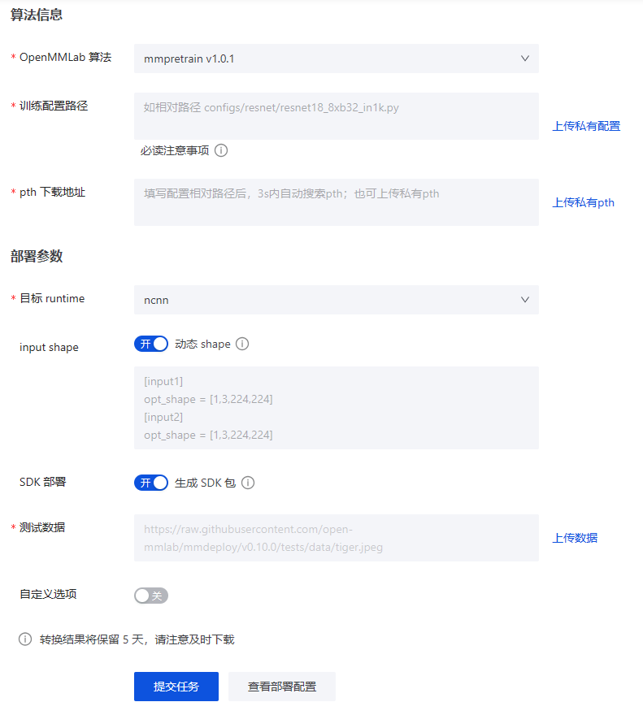

# 西瓜语义分割部署（PC端）

## 模型部署概述
模型部署是把使用深度学习框架训练好的模型，部署到终端设备上的过程，可以是PC，手机，树莓派，无人机，机器人。“手机本地可以使用深度学习模型实时推理”，这一听就是件有趣的事情，也是一件难事吧。手机上这么小的一颗芯片，能够支持模型进行推理吗？  
这里延伸出两个问题：
- 为什么我们需要部署（部署的作用是什么
- 部署会对模型有什么优化效果

> 模型部署到终端，使用的是终端的什么资源

### 整个流程
深度学习框架-->模型中间表示-->推理引擎  
模型的结构和参数被转换成一种只描述网络结构的中间表示表 
推理引擎把中间表示转换成特定格式，可以在硬件上高效运行

## 实践：把pytorch模型转换成onnx格式
这里的模型训练使用了MMsegmentation，自然的我们使用OpenMMLab的官方部署工具来部署
1. 安装MMdeploy
    ```pip
    pip install mmdeploy
    ```
2. 安装推理框架onnxruntime
    ```pip
    pip install onnxruntime
    ```
3. 验证安装情况
    ```python
    import mmdeploy
    import onnxruntime as ort
    print(mmdeploy.__version__)
    # '1.2.0'
    print(ort.__version__)
    # '1.15.1'
    ```
4. 模型转换
    - [在线模型转换工具](https://platform.openmmlab.com/deploee)
    
    填写选项和上传配置项，提交任务，等待一会，得到了转换结果，下载到本地
    
    
        

5. 模型部署
    - 安装推理后端和一些工具包（：
    ```pip
    # pip install mmdeploy-runtime
    pip install mmdeploy-runtime-gpu
    pip install matplotlib tqdm opencv-python tqdm
    ```    
    - 本地onnxruntime部署
    - 本地MMdeploy-runtime部署
    - 其实这些推理后端都是差不多的，主要看他们对硬件的适配情况
6. 出现问题  
    **(TODO.)** 使用MMdeploy进行部署推理时，device选择为cuda报错，还没解决，CPU是没有问题的